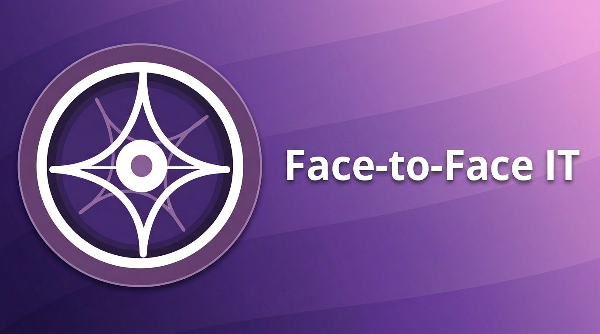

# Welcome to Face-to-Face IT

Face-to-Face Integrated Technologies helps human services teams navigate process, practice, and technology for service delivery. We primarily work with Native American communities and child welfare programs.

## What We Do

We combine direct practice experience with product, platform, and delivery expertise to support child welfare and human services organizations. Our work includes process improvement, documentation, training, quality improvement, and the technology systems that support those programs.

## Focus Areas

- Child welfare and human services delivery
- Multi-tenant platform and application development
- Directus customization and extension work
- Infrastructure automation and cloud delivery
- Process documentation, training, and implementation support

## How We Work

We bring together practice knowledge and technical delivery to build systems that are maintainable, secure, and aligned to real-world agency operations. Much of the work in this organization supports internal systems and client environments, so not every repository is publicly visible.
